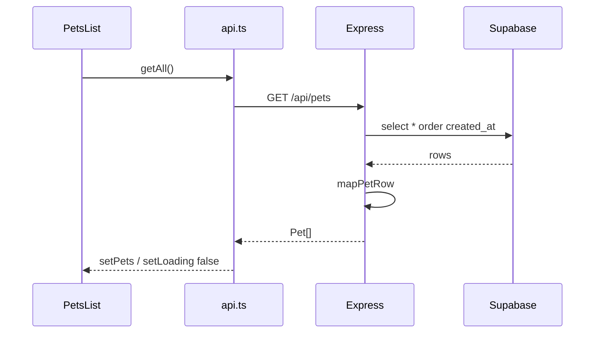
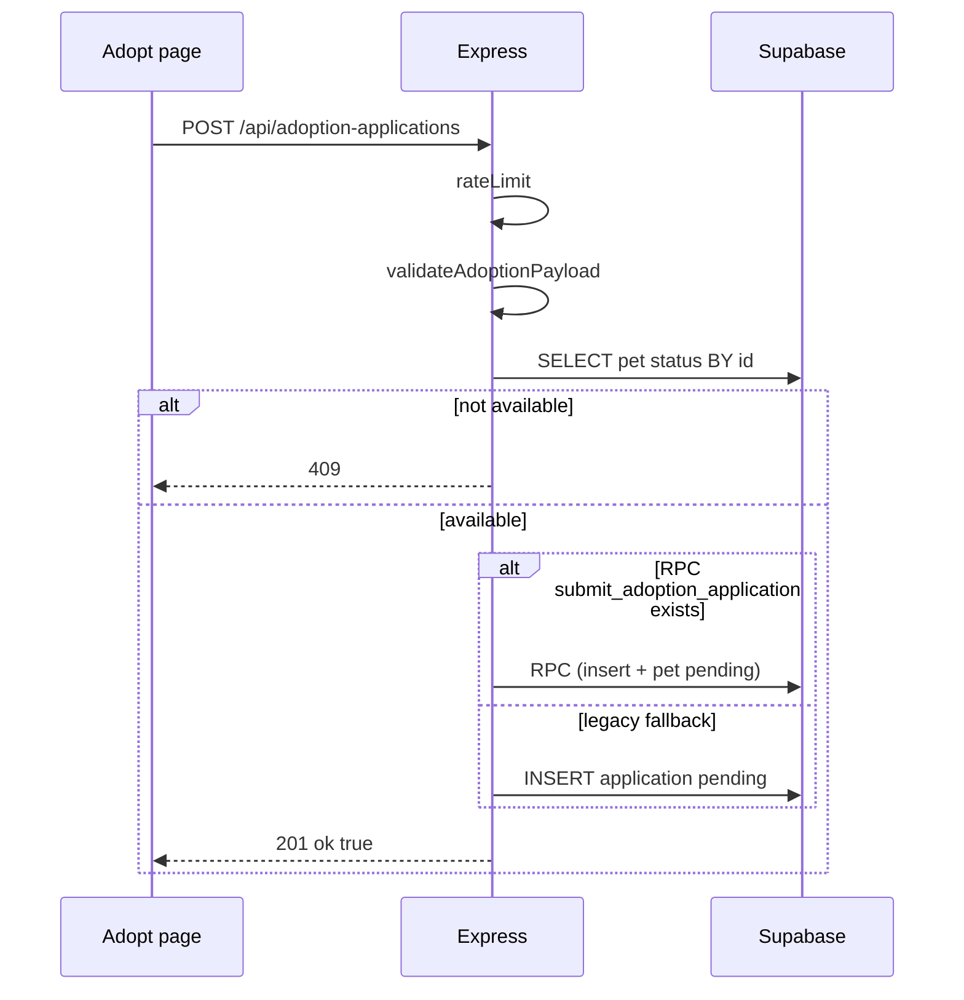

# TDD — Technical Design Document

**Product**: DoodlePaws v1.0  
**Refs**: [SRS](SRS.md) · [C4](architecture/c4.md) · [State machines](architecture/state-machines.md) · [OpenAPI](openapi.yaml)

---

## 1. Design principles

| Principle | Decision |
|-----------|----------|
| BFF as write gate | Browser never holds service role; validation on server |
| Contract-first | OpenAPI canonical; mapper produces DTOs |
| Fail visible | Reads: loading → error+retry or success |
| Explicit v1 limits | TOCTOU, RLS gap, client-side filter — documented not hidden |

---

## 2. Pet catalog (FR-1)

### Sequence



### Client filter logic (FR-1.4, FR-1.5)

```
matchesSearch = name or tags contains search (case insensitive)
matchesTags = no pills OR pet.tags intersects activePills (OR semantics)
visible = matchesSearch AND matchesTags
```

**Scale:** Valid for ≤100 pets (NFR-1.4). **v1.1:** optional `GET /api/pets?limit=&offset=` (max 100) — UI still loads full catalog. **v2:** server-side `tag`, `q`, `status` filters.

### Pagination (v1.1 implemented)

| Param | Rule |
|-------|------|
| `limit` | 1–100 (default: return all when omitted) |
| `offset` | ≥0 |

Backend: `parsePaginationQuery` in [`index.ts`](../../src/backend/src/index.ts). OpenAPI: [openapi.yaml](openapi.yaml).

### Tag pills

Hardcoded: `Very Wiggly`, `Expert Napper`, `Gentle` — subset of seed tags ([ERD](architecture/erd.md)).

---

## 3. Pet detail (FR-2)

| HTTP | Client |
|------|--------|
| 200 | `Pet` |
| 404 | `undefined` → "Pup not found!" |
| other | error UI + retry |

**CTA:** render adopt block only if `pet.status === 'available'` ([state-machines](architecture/state-machines.md)).

---

## 4. Adoption submit (FR-3)

### Sequence



**v2 path:** When [`v2-migration.sql`](../../src/backend/supabase/v2-migration.sql) applied, RPC runs in one transaction — pet → `pending`, no TOCTOU ([state-machines](architecture/state-machines.md) §4).

**Legacy fallback:** Two round trips without transaction — concurrent POSTs can both pass availability check; pet status unchanged.

### Adopt page guard (FR-3.6)

On load, if `pet.status !== 'available'`: show blocking message (same as detail CTA hidden); do not render submit form.

### Validation

| Field | Rule |
|-------|------|
| `petId` | `/^[a-z0-9-]+$/`, trim |
| `applicantName`, `favoriteSnack` | non-empty, max 200 |
| `promiseGiven` | `true` |

### Rate limit

In-memory Map, 10/min/IP on POST only. **Deploy:** single API replica for demo or accept uneven limits (OQ4).

---

## 5. Health endpoints (FR-4)

| Endpoint | v1 | Checks |
|----------|-----|--------|
| `GET /health` | Implemented | Express process |
| `GET /health/ready` | Implemented | Supabase ping (operator UC-5) |

Operator flow: `GET /health` (liveness) then `GET /health/ready` (DB) before smoke-testing `/api/pets`.

---

## 6. Error handling

| Layer | Rule |
|-------|------|
| Backend | PGRST116→404; schema→503; other→500 generic |
| Frontend | `ApiError.status`; always `setLoading(false)` in `finally` |
| Submit errors | Parse JSON `error` field when possible (v1.1) |

---

## 7. State management

Page-local `useState` only — no global store v1.

| Page | Key state |
|------|-----------|
| PetsList | pets, search, activeTags, loading, error |
| PetDetail | pet, loading, error |
| Adopt | pet, form, submitting, loadError, submitError, submitted |

---

## 8. Security

| Concern | Implementation |
|---------|----------------|
| Secrets | No keys in Vite bundle |
| CORS | Mode A default — see [C4](architecture/c4.md) |
| RLS gap | Documented; v2 revoke anon INSERT |

---

## 9. File map

| Concern | Path |
|---------|------|
| API routes | `src/backend/src/index.ts` |
| Admin routes | `src/backend/src/admin.ts` |
| Admin auth middleware | `src/backend/src/middleware/adminAuth.ts` |
| Errors | `src/backend/src/errors.ts` |
| App routes | `src/frontend/src/app/routes.tsx` |
| HTTP client | `src/frontend/src/shared/api/client.ts` |
| Feature pages | `src/frontend/src/features/*/pages/*Page.tsx` |
| UI copy | `src/frontend/src/shared/constants/uiCopy.ts` |
| Filter pills | `src/frontend/src/features/pets/constants.ts` |
| Admin UI | `src/frontend/src/features/admin/pages/*` |

---

## 10. Admin review (FR-5, v2)

| Step | Path |
|------|------|
| Login | POST `/api/admin/login` `{ apiKey }` — validates `ADMIN_API_KEY` |
| Session | Client stores key; sends `X-Admin-Key` on admin routes |
| List | GET `/api/admin/applications?status=pending` |
| Review | POST `/api/admin/applications/:id/review` `{ action }` → RPC `review_adoption_application` |

Requires `v2-migration.sql` for atomic approve/reject + pet status updates.

---

## Related

- [User flows](ux-ui-flows/user-flows.md) · [ERD](architecture/erd.md)
