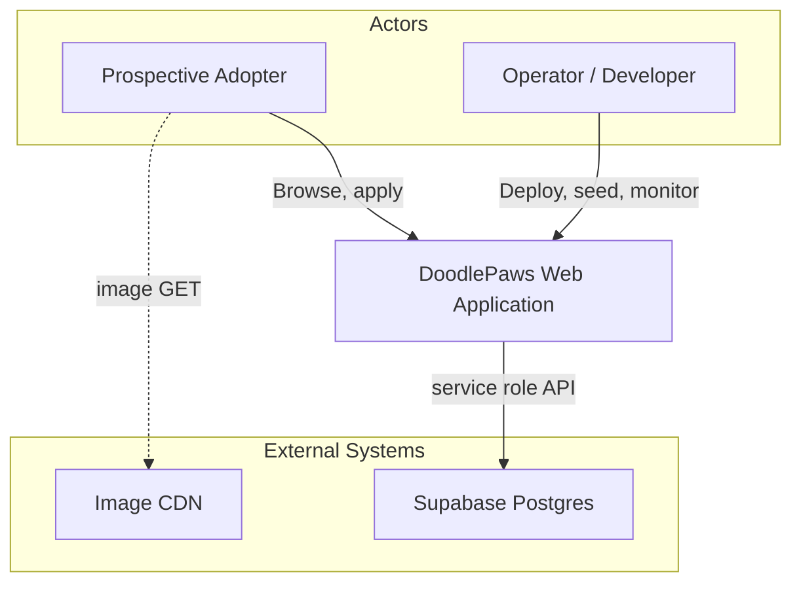
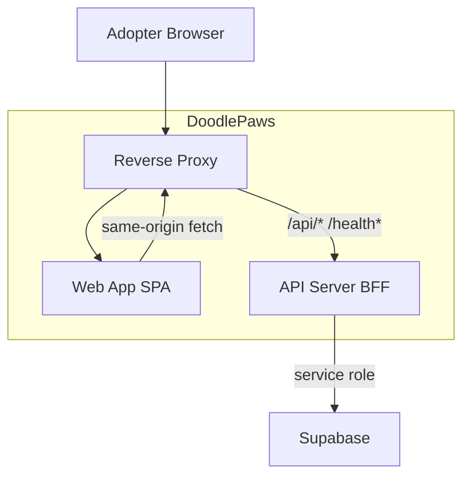
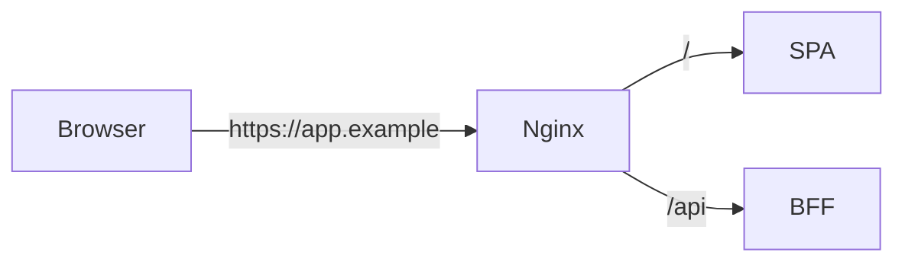
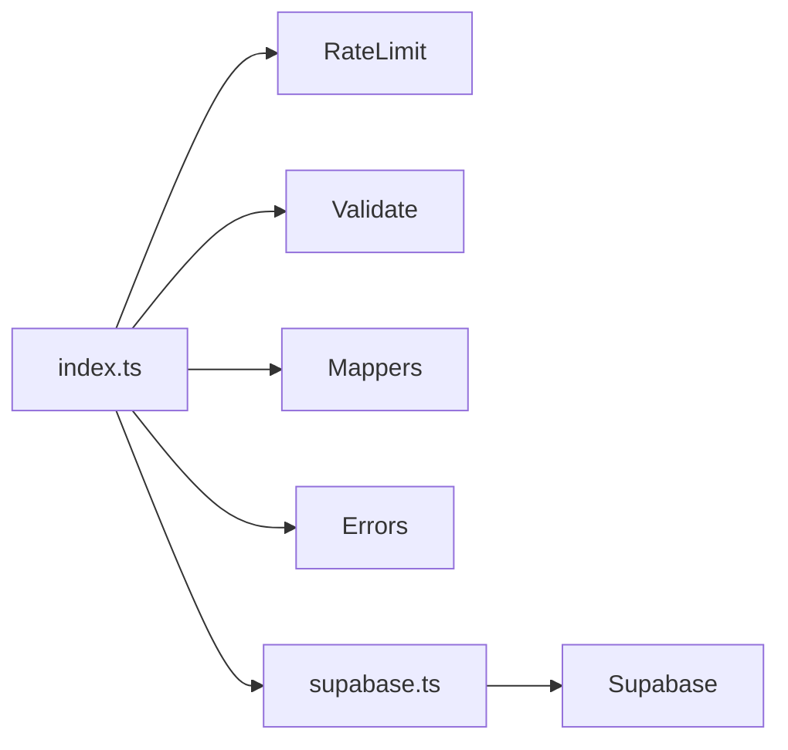
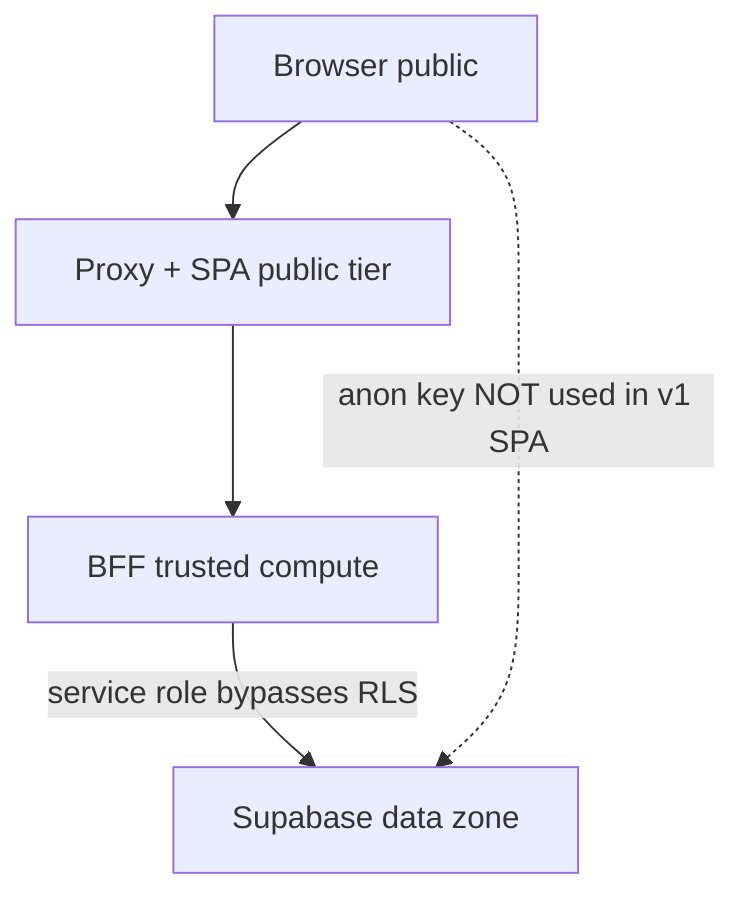

# System Architecture — C4 Model

**Product**: DoodlePaws v1.0  
**Notation**: [C4 Model](https://c4model.com/) — Context (L1), Container (L2), Component (L3)

---

## Level 1 — System Context

| Element | Description |
|---------|-------------|
| **DoodlePaws** | React SPA + Express BFF |
| **Supabase** | Authoritative data store |
| **CDN** | External pet image URLs (not uploaded by app) |

---

## Level 2 — Container Diagram

| Container | Tech | Responsibility |
|-----------|------|----------------|
| **Web App** | React 19, React Router | UI, client routing, fetch |
| **Reverse Proxy** | Vite dev / nginx Docker | Static assets + API proxy |
| **API Server** | Express 4, TypeScript | Validation, rate limit, Supabase access |
| **Supabase** | Postgres + PostgREST | Persistence, RLS |

---

## Deployment topologies

### Mode A — Same-origin proxy (recommended default)

Used by: **local dev**, **Docker Compose**, typical **Cloud Run + nginx** setup.

| Property | Value |
|----------|-------|
| Browser origin | Single host (e.g. `:3000`, `:8080`) |
| API path | Relative `/api/*`, `/health` via proxy |
| **CORS** | **Not required** (same origin) |
| `CORS_ORIGIN` | Unset OK in production for this mode |

### Mode B — Split API host

Used when: SPA and API on **different origins** (e.g. `app.run.app` + `api.run.app`).

| Property | Value |
|----------|-------|
| Browser | Calls `https://api.example/...` directly or via `VITE_API_BASE_URL` |
| **CORS** | **Required** — set `CORS_ORIGIN` to SPA origin(s) |
| Risk | Misconfiguration blocks all API calls |

**Document which mode your environment uses** in operator runbook ([overview.md](overview.md)).

### Cloud Run note

C4 does not mandate split vs combined. Minimum prod checklist:

1. Pick Mode A or B explicitly.
2. If Mode B → set `CORS_ORIGIN`.
3. Never expose `SUPABASE_SERVICE_ROLE_KEY` to SPA build.

---

## Level 3 — Component Diagram (BFF)

| Component | Role |
|-----------|------|
| `index.ts` | HTTP routes, adoption business rules |
| `errors.ts` | PostgREST → HTTP mapping |
| `mappers.ts` | snake_case → camelCase DTO |
| `api.ts` (frontend) | `ApiError`, fetch wrapper |

Frontend logical components: `App` → `pages/*` → `services/api.ts` → BFF.

---

## Threat model & BFF rationale

| Threat | Mitigation (v1) | Gap |
|--------|-----------------|-----|
| Service role key in browser | BFF only; never in Vite bundle | OK if env secured |
| Unvalidated adoption spam | BFF rate limit + validation | See RLS gap below |
| Direct PostgREST bypass | RLS allows anon INSERT on applications | **v1 schema gap** — see [ERD RLS](erd.md) |
| Catalog scraping | No rate limit on GET | Accept for demo; add CDN/cache v2 |
| Concurrent double-submit | No DB transaction lock | Documented in [state-machines](state-machines.md) |

### Why BFF instead of browser → Supabase only?

| Reason | Explanation |
|--------|-------------|
| **Secret handling** | Service role must not ship to client |
| **Centralized rules** | Validation, rate limit, availability check in one place |
| **Stable API** | OpenAPI contract decouples UI from PostgREST shape |
| **Future admin** | v2 admin routes extend BFF without exposing Supabase |

**Alternative** (not chosen): anon read + Supabase Edge Function for writes. BFF chosen for coursework clarity and OpenAPI contract.

---

## Security zones (accurate)

- v1 SPA **does not** call Supabase directly.
- RLS anon INSERT on applications is **legacy/schema permissive** — target hardening in v2 (ERD).

---

## Related docs

- [State machines](state-machines.md)
- [ERD & RLS](erd.md)
- [Overview / deploy](overview.md)
- [OpenAPI](../openapi.yaml) · [SRS](../SRS.md) · [TDD](../TDD.md)
