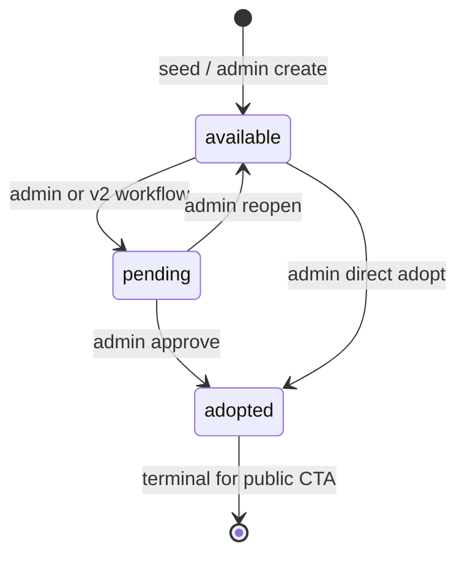
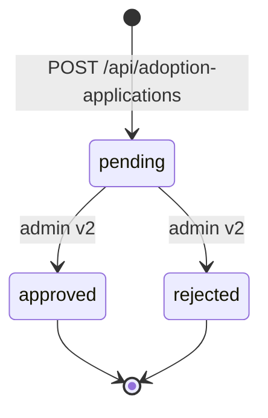

# State Machines — Pets & Adoption Applications

**Product**: DoodlePaws v1.0  
**Related**: [ERD](erd.md) · [SRS FR-2/FR-3](../SRS.md) · [OpenAPI](../openapi.yaml)

---

## 1. Pet status (`pets.status`)

| Status | Public list | Detail badge | Adopt CTA | POST accepted |
|--------|-------------|--------------|-----------|---------------|
| `available` | Shown | Yes | Shown | Yes |
| `pending` | Shown | Yes | Hidden | No (409) |
| `adopted` | Shown | Yes | Hidden | No (409) |

### v2 behavior (when `v2-migration.sql` applied)

| Event | Pet transition |
|-------|----------------|
| Application submitted | `available` → `pending` (RPC `submit_adoption_application`) |
| Application approved | `pending` → `adopted` (admin v2 — not implemented) |
| Application rejected | `pending` → `available` (admin v2 — not implemented) |

BFF calls RPC with `SELECT … FOR UPDATE` semantics inside Postgres. Legacy v1 path (no RPC) leaves pet status unchanged — see fallback in `index.ts`.

### v1 behavior (legacy fallback, no migration)

- **Submitting an application does not change `pets.status`** when RPC is absent.
- `pending` / `adopted` on pets require manual Supabase updates until v2 migration runs.

### v1 default (OQ1) — superseded by v2 migration

- OQ1 default was “no auto pending”; **v2 migration changes this** when RPC is deployed.

---

## 2. Application status (`adoption_applications.status`)

### v1 behavior

- Every successful POST creates row with **`pending`**.
- No API or UI to transition to `approved` / `rejected`.
- Operator reviews via Supabase dashboard (service role).

---

## 3. Cross-entity consistency rules

| Rule | v1 | v2 target |
|------|-----|-----------|
| Pet `available` before POST | Enforced in BFF (check before insert) | Same + DB trigger optional |
| Pet status after POST | Unchanged | `available` → `pending` |
| Application status after POST | `pending` | `pending` |
| List shows non-available pets | Yes (all pets returned) | Configurable filter |

See [SRS FR-1.6](../SRS.md) for list visibility policy.

---

## 4. Concurrency (adoption POST)

**v2 (with RPC):** Single transaction via `submit_adoption_application` — no TOCTOU when migration applied.

**v1 fallback:** BFF runs `SELECT status` then `INSERT` without a serializable transaction. Two concurrent POSTs for the same available pet can both succeed (OQ2 allows duplicate applications).

---

## Related

- [C4 deployment & threat model](c4.md)
- [TDD adoption sequence](../TDD.md)
