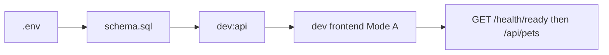

# User Flow & Use Cases

**Product**: DoodlePaws v1.0 · **Auth**: None  
**State rules:** [state-machines.md](../architecture/state-machines.md)

---

## Use cases

| UC | Name | Actor | Preconditions |
|----|------|-------|---------------|
| UC-1 | Browse catalog | Visitor | API + DB ready |
| UC-2 | Search/filter | Visitor | On `/pets` |
| UC-3 | View profile | Visitor | Valid pet id |
| UC-4 | Submit application | Visitor | Pet `status=available` |
| UC-5 | Deploy/seed | Operator | Supabase project |

UC-2 extends UC-1. UC-4 includes UC-3 (must load pet before submit).

---

## Flow 1 — Discovery

```mermaid
flowchart TD
  Start([/]) --> Browse{Browse Pets?}
  Browse -->|Yes| List[/pets]
  Browse -->|No| Anchor[#why-doodlepaws]
  List --> LoadList[GET /api/pets]
  LoadList -->|Error| Retry[Try Again]
  LoadList -->|OK| Grid[Grid all statuses FR-1.6]
  Grid --> Filter[Search AND tag pills OR]
  Filter --> Detail[/pet/:id]
  Detail --> LoadOne[GET /api/pets/:id]
  LoadOne -->|404| NotFound[Not found]
  LoadOne -->|OK| Profile[Badge + CTA if available]
```

---

## Flow 2 — Adoption (FR-3.6)

```mermaid
flowchart TD
  Profile[Detail available] --> CTA[Apply to Adopt]
  CTA --> Form[/adopt/:id]
  Form --> Load[GET /api/pets/:id]
  Load -->|not available| Block[Block message no form]
  Load -->|available| Fill[Form]
  Fill --> POST[POST application]
  POST -->|201| Success[Wag-tastic]
  POST -->|409/429/400| Err[Error banner]
  Success --> Wait[3s] --> List[/pets]
```

### v2 note (when `v2-migration.sql` applied)

After successful POST, backend RPC sets **`pets.status` → `pending`**. User sees success screen and redirect as today; on return to `/pets`, badge shows **Pending** (no UI change required — badge reads live status from API). See [state-machines](../architecture/state-machines.md).

| HTTP | UX |
|------|-----|
| 201 | Success + redirect |
| 400 | Validation error banner |
| 409 | Pet no longer available |
| 429 | Too many requests |

Direct navigation to `/adopt/:id` for unavailable pet → **block message**, not form.

---

## Flow 3 — Operator (UC-5)



---

## Screen map

| Route | UC | Notes |
|-------|-----|-------|
| `/` | UC-1 | → `/pets`, `#why-doodlepaws` |
| `/pets` | UC-1, UC-2 | OR tag pills; search AND tags |
| `/pet/:id` | UC-3 | CTA if `available` |
| `/adopt/:id` | UC-4 | Form only if `available` |

---

## Detail docs

- [Browse](browse-pets.md) · [Adopt](adopt-application.md) · [UI rules](ux-ui-rules.md)

## Related

[PRD](../PRD.md) · [SRS](../SRS.md) · [TDD](../TDD.md)
